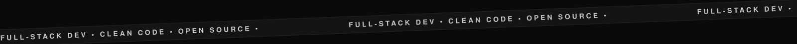

 

<i>Software Developer designing full‑stack products that feel as clear 
as they are well engineered. Welcome to my corner of GitHub.</i>

 

<h5>▪ &nbsp;▪ &nbsp;&nbsp;01&nbsp;&nbsp;—&nbsp;&nbsp;TECH STACK</h5>

  
  
  
  
  
  
  
  
  
  
  
  
  
  
  
  
  
  
  
  
  
  
  
  
  

 

 

<h5>▪ &nbsp;▪ &nbsp;&nbsp;02&nbsp;&nbsp;—&nbsp;&nbsp;GITHUB ANALYTICS</h5>

  

 

<h5>▪ &nbsp;▪ &nbsp;&nbsp;03&nbsp;&nbsp;—&nbsp;&nbsp;SELECTED WORK</h5>

<b>PROFESSIONAL&nbsp;CERTIFICATION</b>&nbsp; &#8226; &nbsp;Parchment&nbsp;/&nbsp;Badgr

 

 

<b>HOLOPIN&nbsp;COLLECTION</b>&nbsp; &#8226; &nbsp;Community&nbsp;Achievements

 

  

